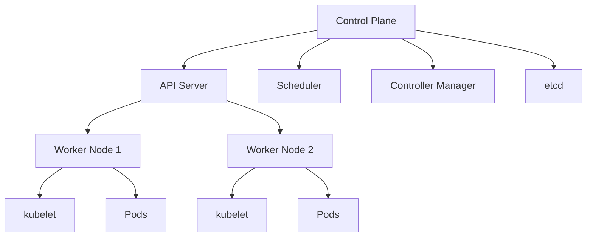

# Arquitetura Kubernetes

## Visão Geral

```mermaid
graph TD

CP[Control Plane]

CP --> API[API Server]

CP --> SCH[Scheduler]

CP --> CM[Controller Manager]

CP --> ETCD[etcd]

W1[Worker Node 1]

W1 --> K1[kubelet]

W1 --> P1[Pods]

W2[Worker Node 2]

W2 --> K2[kubelet]

W2 --> P2[Pods]

API --> W1

API --> W2
```