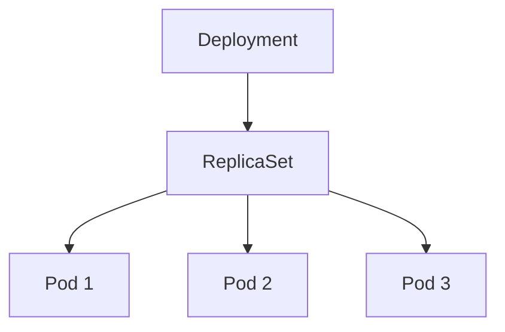

# Deployments

Deployments gerem Pods de forma declarativa.

Permitem:

- Escalar aplicações
- Atualizações controladas
- Rollback
- Auto-recuperação

## Arquitetura



## Listar Deployments

```bash
kubectl get deployments
```

## Criar Deployment

```bash
kubectl create deployment nginx \
--image=nginx
```

## Escalar

```bash
kubectl scale deployment nginx \
--replicas=3
```

## Atualizar imagem

```bash
kubectl set image deployment/nginx \
nginx=nginx:latest
```

## Histórico

```bash
kubectl rollout history deployment nginx
```

## Rollback

```bash
kubectl rollout undo deployment nginx
```

## Ver estado

```bash
kubectl rollout status deployment nginx
```

## Troubleshooting

Ver deployment:

```bash
kubectl describe deployment nginx
```

Ver pods relacionados:

```bash
kubectl get pods
```

Ver eventos:

```bash
kubectl get events
```
