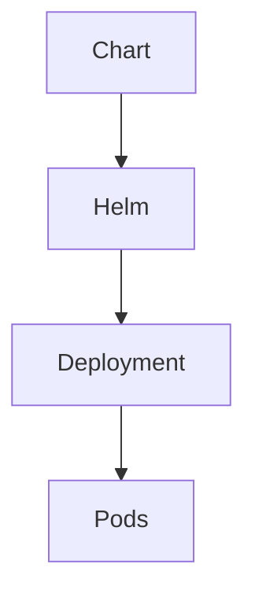

# Helm

Helm é o gestor de pacotes do Kubernetes.

## Fluxo



## Ver repositórios

```bash
helm repo list
```

## Adicionar repositório

```bash
helm repo add bitnami https://charts.bitnami.com/bitnami
```

## Instalar NGINX

```bash
helm install nginx bitnami/nginx
```