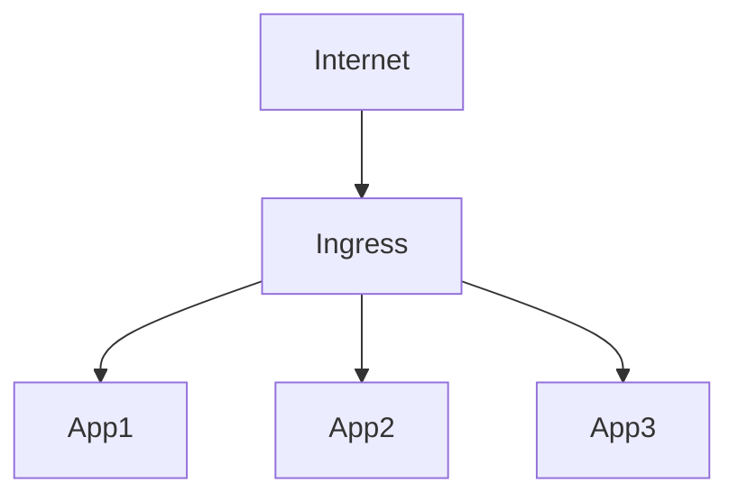

# Ingress

Ingress permite publicar aplicações HTTP e HTTPS.

## Arquitetura



## Ver Ingress

```bash
kubectl get ingress
```

## Exemplo

```yaml
apiVersion: networking.k8s.io/v1

kind: Ingress

metadata:
  name: web-ingress
```
