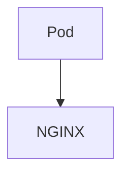

# Lab 02 - Criar Pod NGINX

## Objetivo

Criar um Pod simples.

## Criar Pod

```bash
kubectl run nginx --image=nginx
```

## Verificar

```bash
kubectl get pods
```

## Arquitetura


```mermaid
graph TD

Pod --> NGINX
```
