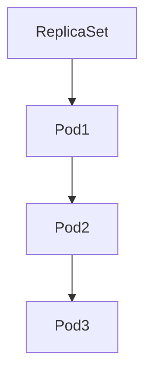

# Lab 04 - Escalar Deployment

## Escalar

```bash
kubectl scale deployment nginx \
--replicas=3
```

## Verificar

```bash
kubectl get pods
```

## Resultado


```mermaid
graph TD

ReplicaSet

--> Pod1
--> Pod2
--> Pod3
```
