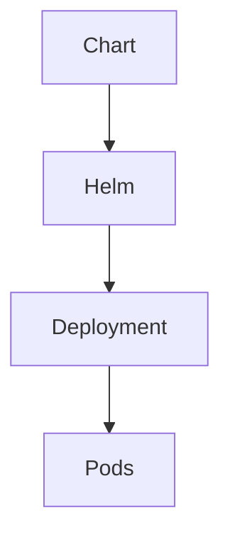

# Lab 10 - Helm

## Adicionar Repositório

```bash
helm repo add bitnami \
https://charts.bitnami.com/bitnami
```

## Instalar NGINX

```bash
helm install nginx bitnami/nginx
```

## Verificar

```bash
helm list
```

## Arquitetura


