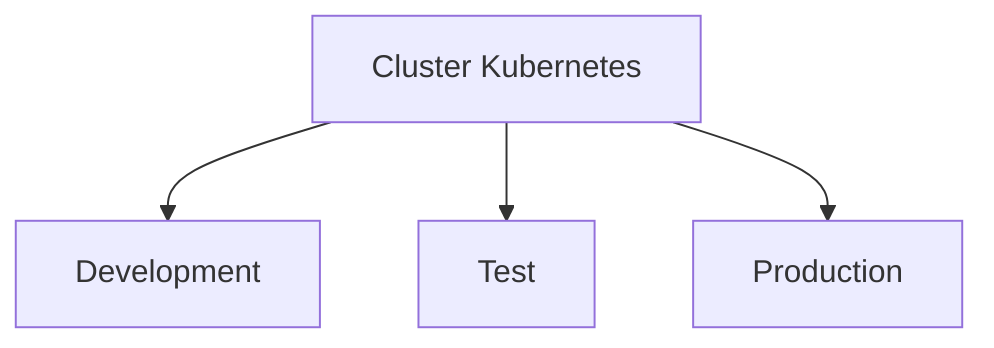

# Namespaces

Namespaces permitem separar recursos dentro de um cluster.

## Estrutura



## Listar

```bash
kubectl get ns
```

## Criar

```bash
kubectl create namespace dev
```

## Apagar

```bash
kubectl delete namespace dev
```

## Ver recursos de um namespace

```bash
kubectl get all -n dev
```

## Exemplo

```yaml
apiVersion: v1
kind: Namespace

metadata:
  name: dev
```
