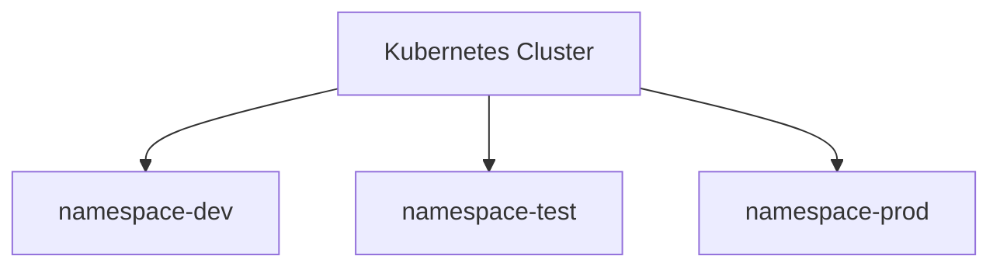

# Namespaces

Namespaces permitem separar recursos dentro de um cluster Kubernetes.

São úteis para:

- Produção
- Desenvolvimento
- Testes
- Equipas distintas

## Arquitetura



## Listar Namespaces

```bash
kubectl get namespaces
```

ou

```bash
kubectl get ns
```

## Criar Namespace

```bash
kubectl create namespace dev
```

## Apagar Namespace

```bash
kubectl delete namespace dev
```

## Trabalhar num Namespace

```bash
kubectl get pods -n dev
```

## Exemplo

Criar um deployment em dev:

```bash
kubectl create deployment nginx \
--image=nginx \
-n dev
```

## Troubleshooting

Ver recursos existentes:

```bash
kubectl get all -n dev
```