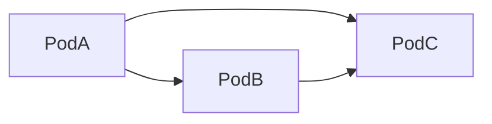
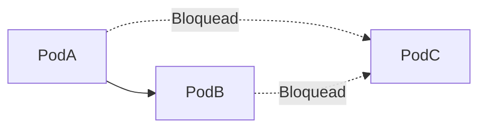

# Network Policies

As Network Policies controlam a comunicação entre Pods.

## Sem Policy



## Com Policy



## Ver policies

```bash
kubectl get networkpolicy
```

## Exemplo

```yaml
apiVersion: networking.k8s.io/v1

kind: NetworkPolicy

metadata:
  name: allow-nginx
```
