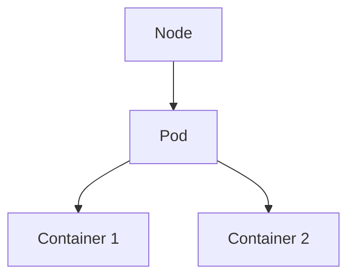

# Pods

Os Pods são a unidade mais pequena executável no Kubernetes.

Um Pod pode conter um ou mais containers que partilham rede e armazenamento.

## Arquitetura



## Listar Pods

```bash
kubectl get pods
```

## Ver detalhes

```bash
kubectl describe pod POD_NAME
```

## Ver logs

```bash
kubectl logs POD_NAME
```

## Entrar no container

```bash
kubectl exec -it POD_NAME -- bash
```

## Exemplo

Criar um Pod nginx:

```bash
kubectl run nginx --image=nginx
```

Verificar:

```bash
kubectl get pods
```

## Troubleshooting

Ver eventos:

```bash
kubectl describe pod POD_NAME
```

Ver logs:

```bash
kubectl logs POD_NAME
```