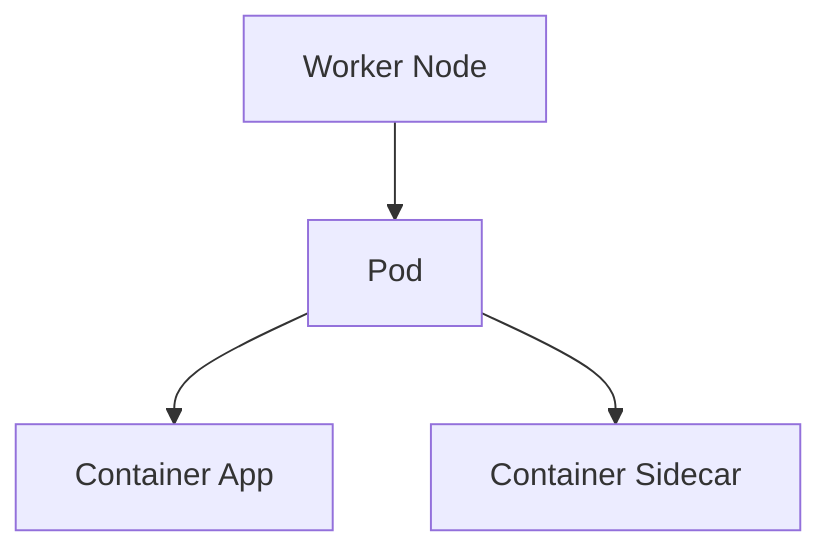
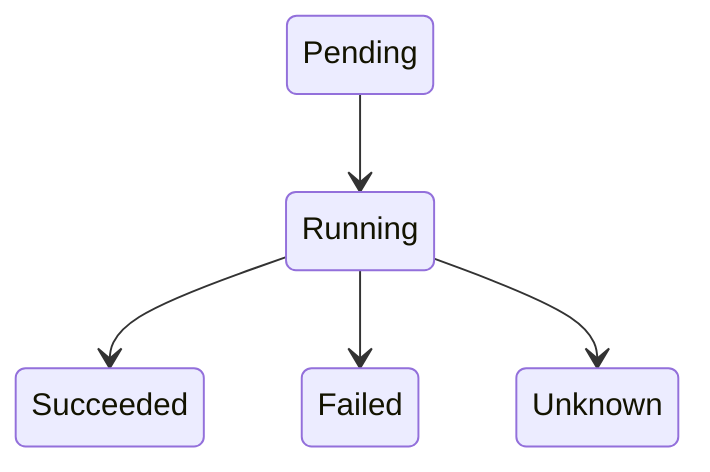

# Pods

Os Pods são a unidade mais pequena executável no Kubernetes.

Um Pod pode conter um ou mais containers.

## Arquitetura



## Criar um Pod

```bash
kubectl run nginx --image=nginx
```

## Listar Pods

```bash
kubectl get pods
```

## Ver detalhes

```bash
kubectl describe pod nginx
```

## Ver logs

```bash
kubectl logs nginx
```

## Entrar no Pod

```bash
kubectl exec -it nginx -- bash
```

## Ciclo de Vida

