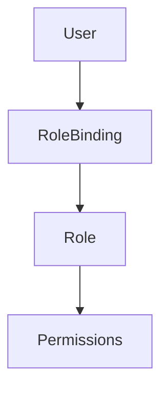

# RBAC

Role Based Access Control.

## Fluxo


```mermaid
graph TD

User

--> RoleBinding

RoleBinding

--> Role

Role

--> Permissions
```

## Ver Roles

```bash
kubectl get roles
```

## Ver RoleBindings

```bash
kubectl get rolebindings
```
