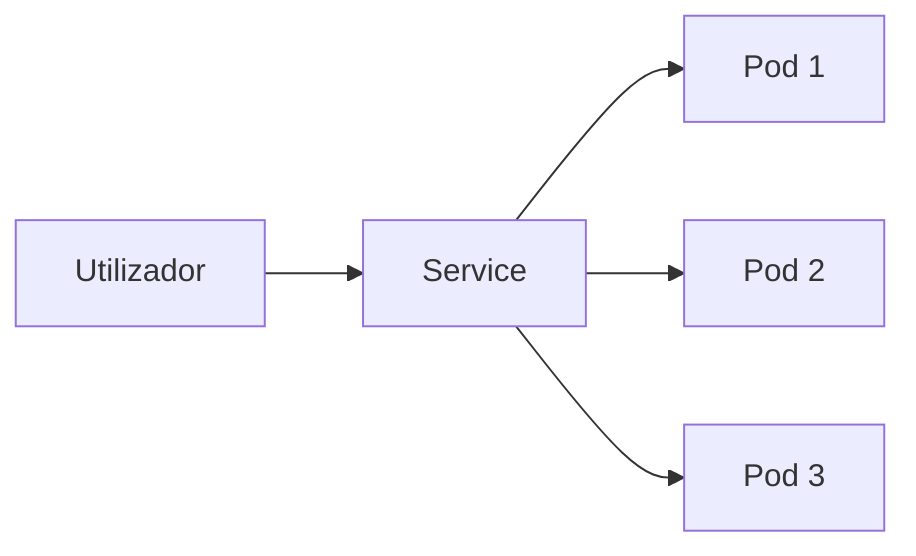

# Services

Os Services permitem expor Pods.

## Fluxo



## Listar

```bash
kubectl get svc
```

## Exemplo Service

```yaml
apiVersion: v1

kind: Service

metadata:
  name: nginx-service

spec:
  selector:
    app: nginx

  ports:
    - port: 80
      targetPort: 80
```