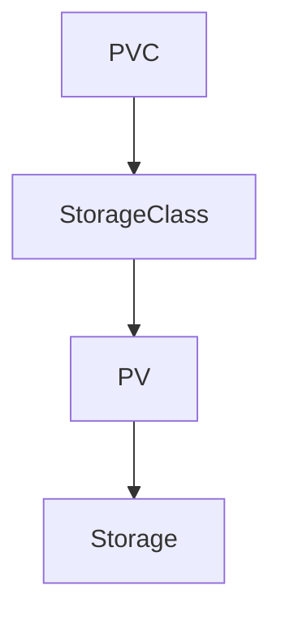

# Storage Classes

Permitem provisionamento dinâmico de volumes.

## Arquitetura


```mermaid
graph TD

PVC

--> StorageClass

StorageClass

--> PV

PV

--> Storage
```

## Ver Storage Classes

```bash
kubectl get storageclass
```